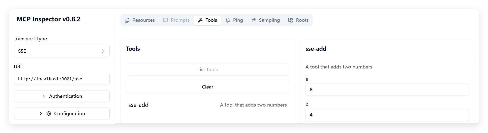

# HTTP with SSE 使用说明

## 基本概念


## sse服务端实现

```ts
import express, { Request, Response } from "express";
import { McpServer, ResourceTemplate } from "@modelcontextprotocol/sdk/server/mcp.js";
import { SSEServerTransport } from "@modelcontextprotocol/sdk/server/sse.js";
import { z } from "zod";
import { CallToolResult, ReadResourceResult } from "@modelcontextprotocol/sdk/types.js";

const server = new McpServer({
  name: "sse-server",
  version: "1.0.0"
});

// Add an addition tool
server.tool("sse-add",
  "A tool that adds two numbers",
  { a: z.number(), b: z.number() },
  async ({ a, b }): Promise<CallToolResult> => ({
    content: [{ type: "text", text: String(a + b) }]
  })
);

// Add a dynamic greeting resource
server.resource(
  "sse-greeting",
  new ResourceTemplate("greeting://{name}", { list: undefined }),
  async (uri, { name }): Promise<ReadResourceResult> => ({
    contents: [{
      uri: uri.href,
      text: `Hello, ${name}!`
    }]
  })
);

const app = express();
const port = 3001;

// to support multiple simultaneous connections we have a lookup object from
// sessionId to transport
const transports: {[sessionId: string]: SSEServerTransport} = {};

// SSE 连接建立
app.get("/sse", async (_: Request, res: Response) => {
  const transport = new SSEServerTransport('/messages', res);
  transports[transport.sessionId] = transport;
  res.on("close", () => {
    delete transports[transport.sessionId];
  });
  await server.connect(transport);
});

// 处理 SSE 消息
app.post("/messages", async (req: Request, res: Response) => {
  const sessionId = req.query.sessionId as string;
  const transport = transports[sessionId];
  if (transport) {
    await transport.handlePostMessage(req, res);
  } else {
    res.status(400).send('No transport found for sessionId');
  }
});


app.listen(port, "localhost", () => {
    console.log(`Server started on port ${port}`);
});
```

## 测试方法

### 使用 Inspector 工具

推荐使用官方提供的 `@modelcontextprotocol/inspector` 工具进行测试：

运行如下命令：

```bash
npx @modelcontextprotocol/inspector
```

访问：http://127.0.0.1:6274/，`TransportType` 选择 `SSE`，如图：


