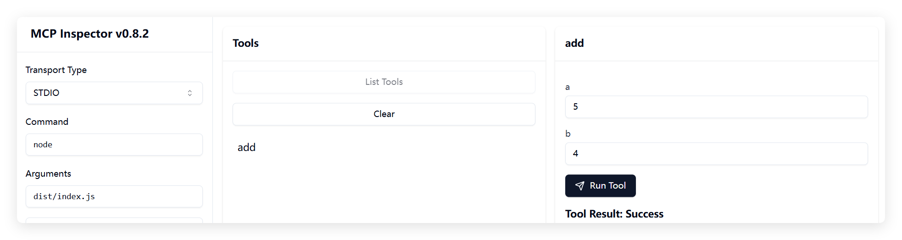
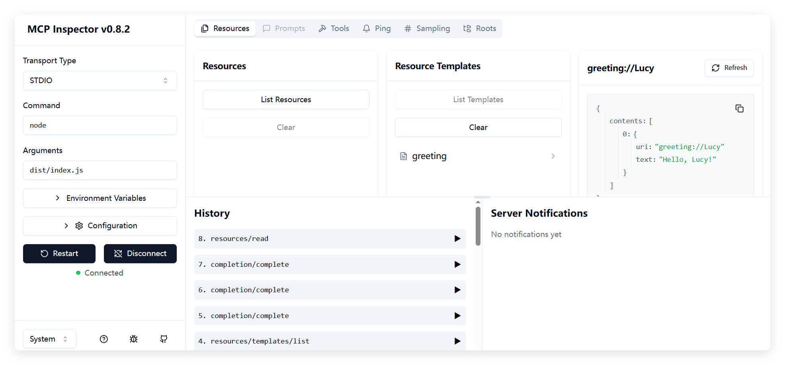

# Stdio Transport 使用说明

## 基本概念

Stdio Transport 是 MCP 协议中的一种传输方式，通过标准输入/输出流进行通信。这种方式特别适合命令行工具和本地开发测试场景。

## 服务端实现

在 `src/stdio/server.ts` 中，我们使用 `StdioServerTransport` 来实现基于标准输入输出的通信：

```typescript
import { McpServer, ResourceTemplate } from "@modelcontextprotocol/sdk/server/mcp.js";
import { StdioServerTransport } from "@modelcontextprotocol/sdk/server/stdio.js";
import { z } from "zod";

async function main() {
  // Create an MCP server
  const server = new McpServer({
    name: "example-server",
    version: "1.0.0"
  });

  // Add an addition tool
  server.tool("add",
    { a: z.number(), b: z.number() },
    async ({ a, b }) => ({
      content: [{ type: "text", text: String(a + b) }]
    })
  );

  // Add a dynamic greeting resource
  server.resource(
    "greeting",
    new ResourceTemplate("greeting://{name}", { list: undefined }),
    async (uri, { name }) => ({
      contents: [{
        uri: uri.href,
        text: `Hello, ${name}!`
      }]
    })
  );

  // Start receiving messages on stdin and sending messages on stdout
  const transport = new StdioServerTransport();
  await server.connect(transport);
  console.log(`Server started (PID: ${process.pid})`);

}

main().catch((error) => {
  console.error(`Fatal error running server (PID: ${process.pid}):`, error);
  if (!process.exitCode) {
    process.exit(1);
  }
});
```

## 客户端实现

在 `src/stdio/client.ts` 中，我们使用 `StdioClientTransport` 来实现客户端：

```ts
import { Client } from "@modelcontextprotocol/sdk/client/index.js";
import { StdioClientTransport } from "@modelcontextprotocol/sdk/client/stdio.js";

const transport = new StdioClientTransport({
  command: "npx tsx",
  args: ["src/index.ts"],
});

const client = new Client({
  name: "example-client",
  version: "1.0.0"
});

async function main() {
  await client.connect(transport);

  // Test the add tool
  console.log("Testing add tool:");
  const addResult = await client.callTool({
    name: "add",
    arguments: {
      a: 4,
      b: 4,
    }
  });
  console.log("4 + 4 =", addResult);

  // Test the greeting resource
  console.log("\nTesting greeting resource:");
  const resource = await client.readResource({
    uri: "greeting://Lucy"
  });
  console.log("Greeting:", resource);
}

main().catch(console.error);
```

## 测试方法

### 使用 Inspector 工具

推荐使用官方提供的 `@modelcontextprotocol/inspector` 工具进行测试：

先build

```bash
pnpm build
```

运行如下命令：

```bash
npx @modelcontextprotocol/inspector node dist/stdio/server.js
```

在界面中操作方法和资源

* `add` 方法
  


* `resource`



### 直接运行客户端

也可以直接运行客户端程序进行测试：

```bash
npx tsx src/stdio/client.ts
```

测试 add 工具输出示例：
```
Testing add tool:
4 + 4 = { content: [ { type: 'text', text: '8' } ] }
```

测试 greeting 资源输出示例：
```
Testing greeting resource:
Greeting: { contents: [ { uri: 'greeting://Lucy', text: 'Hello, Lucy!' } ] }
```